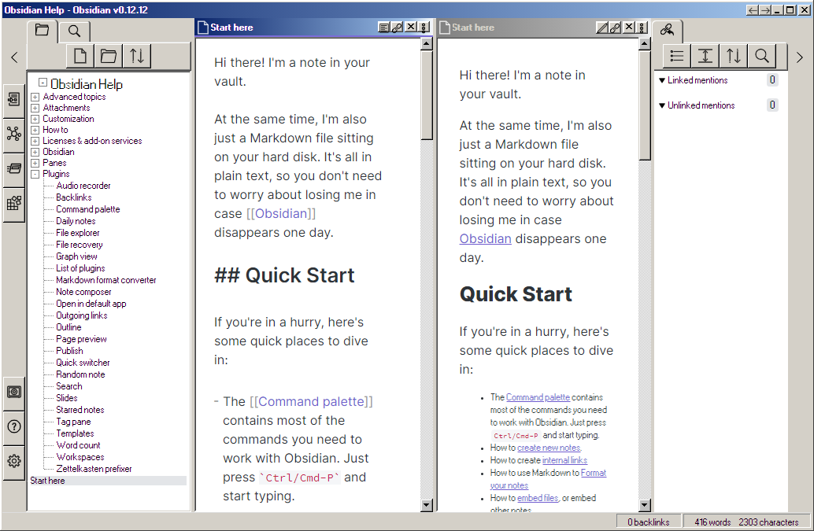
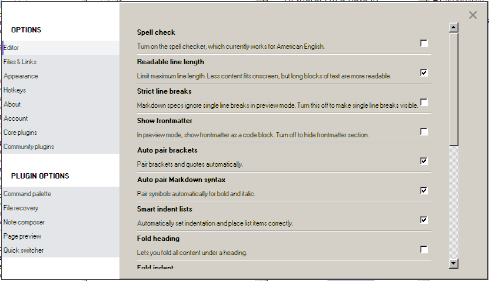

# Obsidian Windows 98 Edition
A windows 98 makeover theme for Obsidian out of nostalgia + spite for all zoomed in "modern" UIs.

This css takes everything from https://jdan.github.io/98.css/  (demo with tabs https://98css-1ts17nxjj.vercel.app/) and some from https://packard-belle.netlify.app/ (components demo http://packard-belle.herokuapp.com/)  

- Windows 98 running in browser in 16 bit mode for reference https://copy.sh/v86/?profile=windows98  
- Windows 2000 running in browser in 32bit mode for reference https://bellard.org/jslinux/vm.html?url=win2k.cfg&mem=192&graphic=1&w=1024&h=768

Current Look

